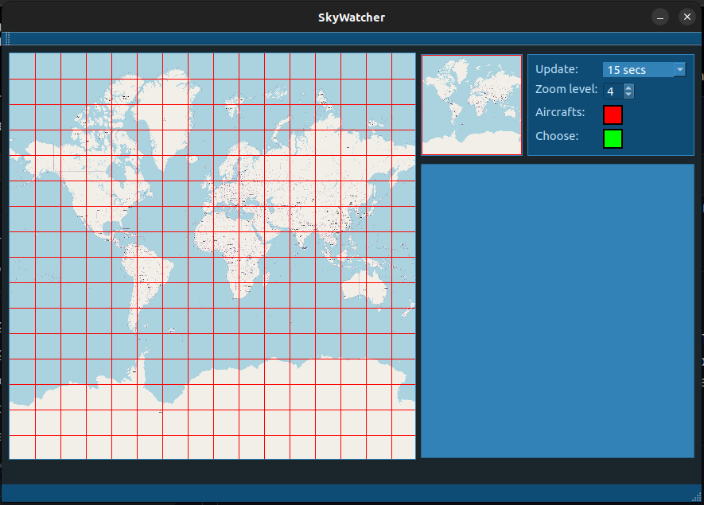
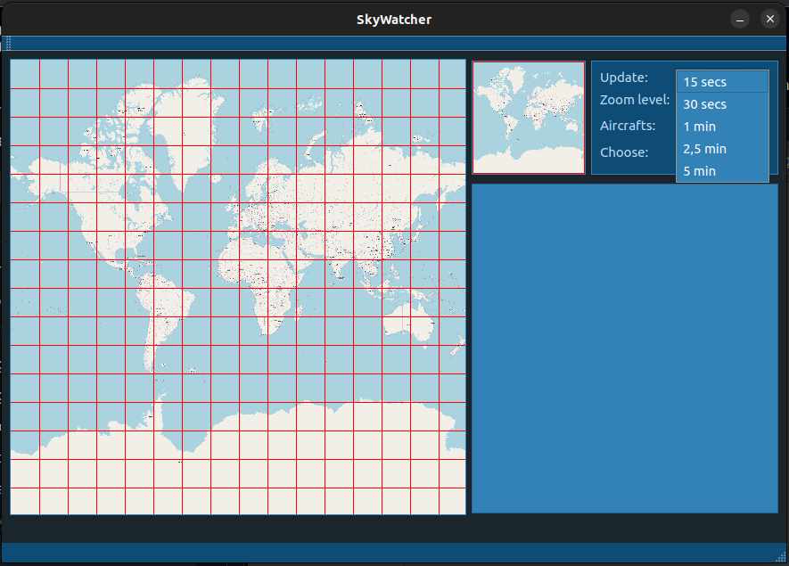
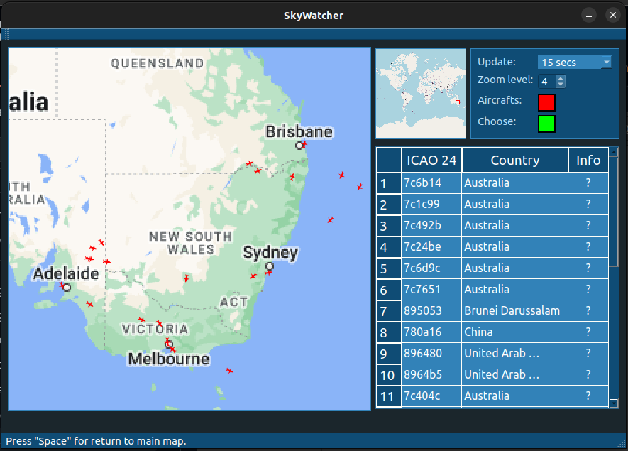
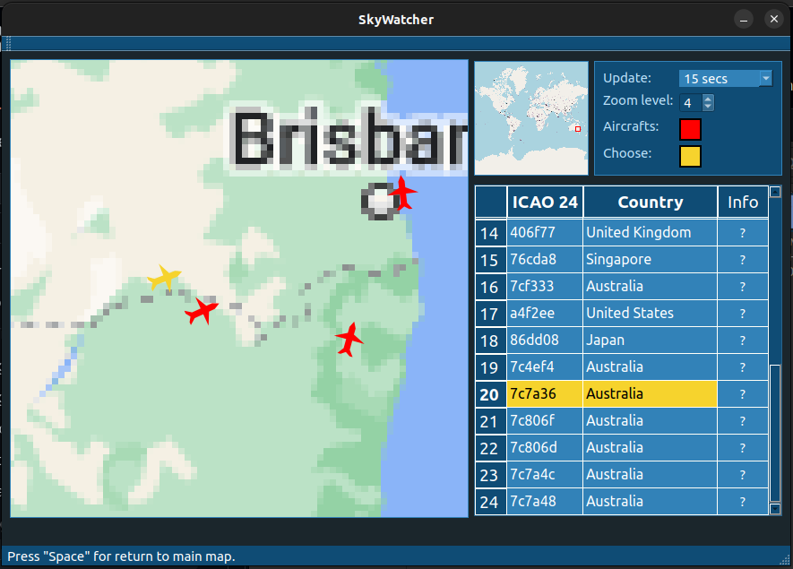
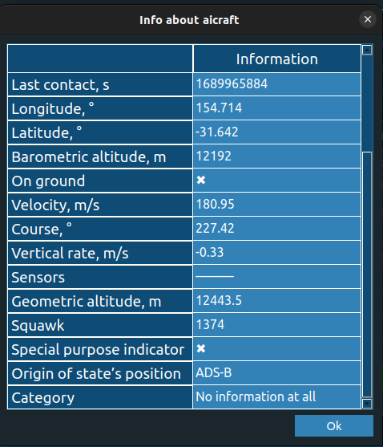

# SkyWatcher
## Описание
__SkyWatcher__ представляет собой программное обеспечение, позволяющий в реальном времени наблюдать за положением воздушных судов.
Данное ПО использует сервисы __OpenSky Network__ и __GoogleMaps__ для реализации необходимого функционала.

Далее на странице будут представлены инструкция по установке, а также пример работы программы.

## Инструкция по установке

## Пример работы
При запуске программы пользователя встречает следующий загрузочный экран:

После него следует главный экран приложения, содержащий в себе: карту, расположенную слева, а также настройки и место, выделенное под таблицу, расположенные в правой части ПО.
Карта позволяет пользователю выбрать сектор, в котором он будет наблюдать за движением воздушных судов. При этом, в таблице будет выведена соответсвующая информация о каждом из них.
Справа сверху распологаются настройки приложения, такие как: время обновления информации, размер одного сектора, цвет самолёта по умолчанию, а также цвет выделения самолёта, в который он окрасится при нажатии на него.

Смена времени обновления информации представлена на изображении ниже. Так, всего есть 5 режимов: обновление информации каждые 15 секунд, 30 секунд, 1 минуту, 2 минуты 30 секунд, 5 минут. 

При выборе сектора приложение отправляет запрос как на __GoogleMaps__, так и на __OpenSky Network__. С __GoogleMaps__ приходит изображение соответствующего сектора, а с __OpenSky Network__ приходит информация о находящихся в данном секторе воздушных судах, содержащая в себе не только информацию о их местоположении, но и другие характеристики. Посмотреть данные характеристики можно, нажав на соответсвующую кнопку напротив интересующего ВС в таблице.

При нажатии на воздушное судно выделяется как сама отметка, так и строка в таблице, соответствующая данному воздушному судну. Данный момент продемонстрирован на следующем изображении.

